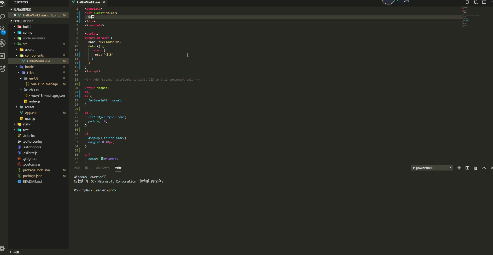

<p align='center'>
   
</p>

## Vue i18n manage
A VS Code plugin for international file management. 


  

## Installation  

1. Install vue-i18n
2. Install vue-i18n-manage
3. In the settings.json file, set your internationalization file path.
4. In the settings.json file, set the main language you are developing.

## Features
1. I18n preview  
2. Extract the selected text to automatically generate the key


## Preview

**v0.3.0 Version**  


## Directory structure
```
locale                //Localized directory               
├── en-US             //English
|   ├── demo.json       
|   ├── ...
├── zh-CN             //Chinese
|   ├── demo.json       
|   ├──  ...
|   index.js          //Generally used to store the code needed to add to the Vue instance
```
## About configuration  
```
  // Set your internationalization file path.
  "vue-i18n-manage.path": "",       

  // Set the main language you are developing.
  "vue-i18n-manage.primaryLanguage": "zh-CN"      
```
  
## Online question / suggestion 
https://github.com/flyer-ui/vue-i18n-manage/issues

## Github  
https://github.com/flyer-ui/vue-i18n-manage

## Future plan
https://github.com/flyer-ui/vue-i18n-manage/projects/1

## VS Code Version
"vscode": "^1.33.0"

## License
[MIT](https://github.com/flyer-ui/vue-i18n-manage/blob/master/LICENSE)  © 2019 [Flyer-UI](https://github.com/flyer-ui/flyer-ui)